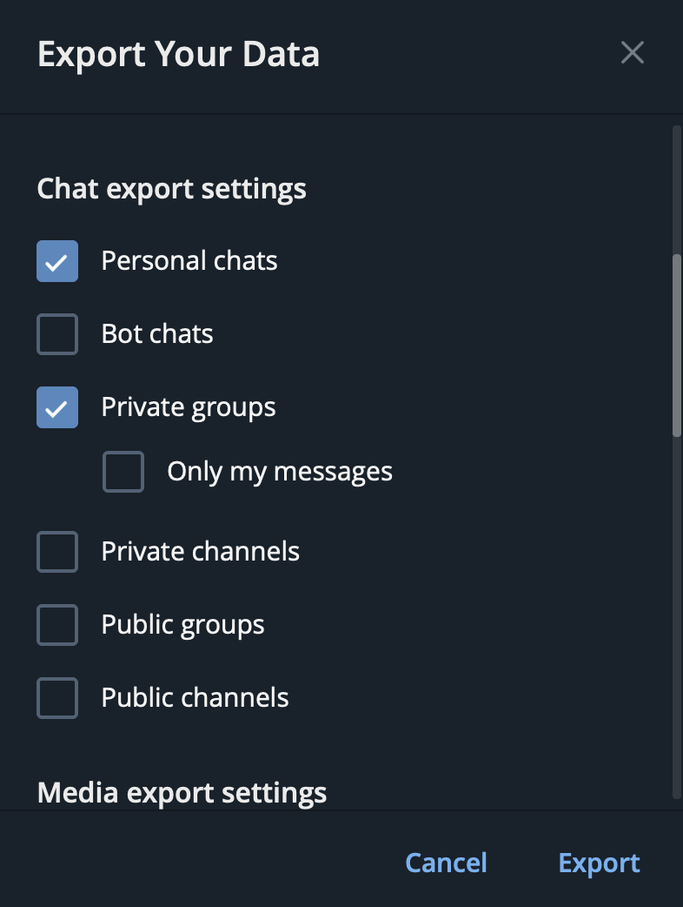

# tglens - Telegram export analytics
Gain insights into your Telegram chats and uncover trends in your messaging behavior.

### Created with
- **Streamlit** - web interface
- **Plotly** - interactive charts and graphs  
- **Pandas** - data processing
- **WordCloud** - word visualization

## Usage
~~‼️**WARNING**‼️ This app will be hosted on Streamlit Community Cloud. BUT I would definitely NOT recommend you upload any of your private info to a server you don't fully trust and know how it works (please don't do that). Even though Streamlit claims they store your data only in RAM, so it's deleted right after the end of session (which I think is probably true). Anyway, you will see a warning when using the hosted version of the app.~~

~~Obviously, the easiest workaround is to run app locally and it's **really easy** even if you haven't done any of these things before.~~

*After some thinking, it was decided to leave the app local only.*

### 🔒 Privacy first
Your data never leaves your computer. Everything runs locally.

### Step 0: Prerequisites
- **Git** 
- **uv** - Python package manager ([install here](https://docs.astral.sh/uv/getting-started/installation/))
- **Python 3.13+** (uv will install if not found)

### Step 1: Get your data
1. Open **Telegram Desktop** (not mobile, not web version, not MacOS native). You need cross-platform Qt version.
> **For macOS users**: You can install Telegram Desktop alongside the native version from the [official download page](https://desktop.telegram.org/)

2. Go to Settings → Advanced (scroll down) → Export Telegram data

3. We need `Personal Chats` + `Private groups`(uncheck `Only my messages` there), so to speed up the process I recommend you check only them and uncheck media export. Then choose **JSON** format and export your chats.


4. Wait for the export to complete.

### Step 2: Clone the repo
```bash
git clone https://github.com/undeluro/tglens.git && cd tglens
```

### Step 3: Run the app
```bash
uv run streamlit run app.py
```

That's it.

## Contributing
Found a bug? Have an idea? Feel free to open an issue or submit a pull request.

---

*Made with ❤️ for curious minds who want to understand their digital conversations better.* 