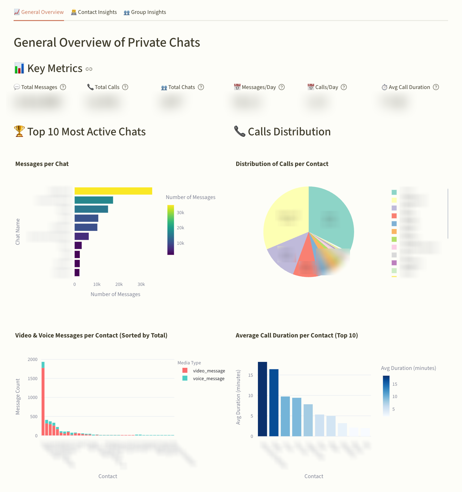
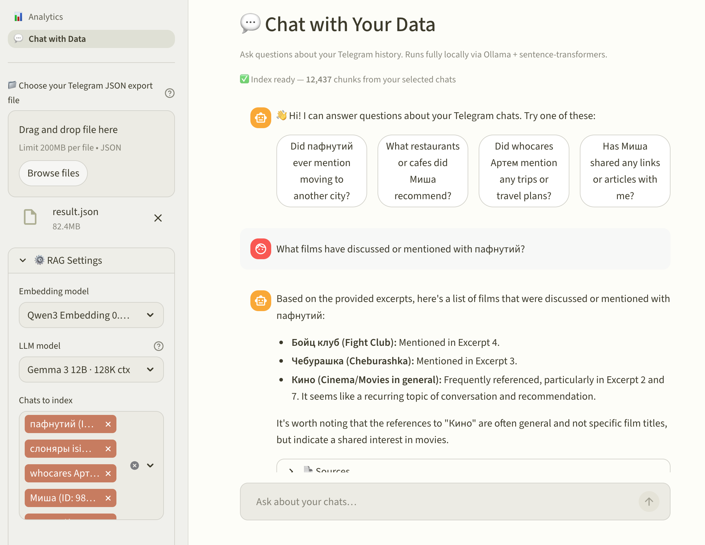
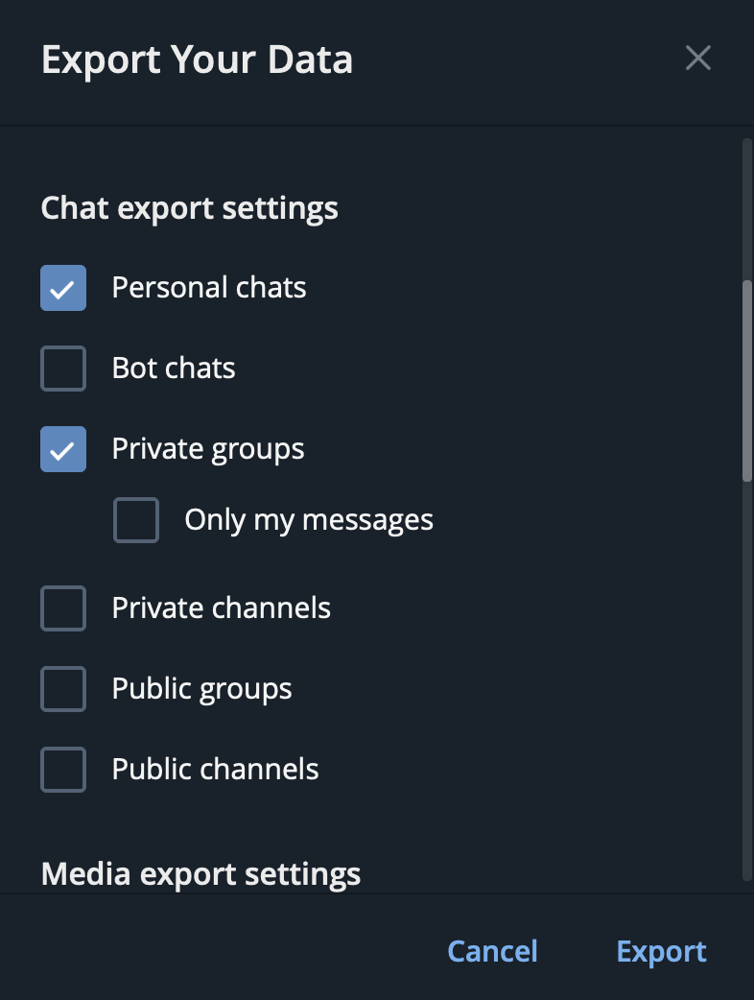

# tglens - Telegram export analytics & chat
Gain insights into your Telegram chats, uncover trends in your messaging behavior, and ask questions about your chat history using a fully local RAG pipeline (time-aware chunking, ChromaDB vector store, MMR retrieval, streaming Ollama generation).

<p>
  
  
</p>

### Built with
- **Streamlit** — web interface
- **Plotly** — interactive charts and graphs
- **Pandas** — data processing
- **WordCloud** — word visualization
- **LangChain + ChromaDB** — RAG pipeline
- **Ollama** — local LLM and embeddings
- **sentence-transformers** — HuggingFace embeddings

## Usage

### 🔒 Privacy first
Your data never leaves your computer. Everything runs locally.

### Step 0: Prerequisites
- **Git** 
- **uv** — Python package manager ([install here](https://docs.astral.sh/uv/getting-started/installation/))
- **Python 3.13+** (uv will install if not found)
- **Ollama** *(for Chat with Your Data, optional)* — [install here](https://ollama.com)

### Step 1: Get your data
1. Open **Telegram Desktop** (not mobile, not web version, not MacOS native). You need cross-platform Qt version.
> **For macOS users**: You can install Telegram Desktop alongside the native version from the [official download page](https://desktop.telegram.org/)

2. Go to Settings → Advanced (scroll down) → Export Telegram data

3. We need `Personal Chats` + `Private groups`(uncheck `Only my messages` there), so to speed up the process I recommend you check only them and uncheck media export. Then choose **JSON** format and export your chats.


4. Wait for the export to complete.

### Step 2: Clone the repo
```bash
git clone https://github.com/undeluro/tglens.git && cd tglens
```

### Step 3: Run the app
```bash
uv run streamlit run app.py
```

That's it.

## Contributing
Found a bug? Have an idea? Feel free to open an issue or submit a pull request.

---

*Made with ❤️ for curious minds who want to understand their digital conversations better.* 